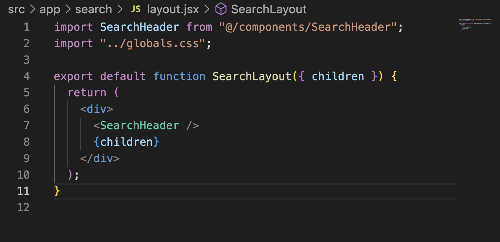
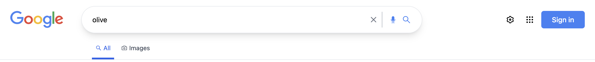
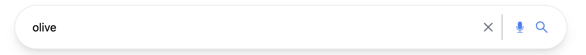
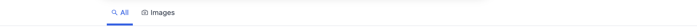

This is a [Next.js](https://nextjs.org/) project bootstrapped with [`create-next-app`](https://github.com/vercel/next.js/tree/canary/packages/create-next-app).

## Getting Started

First, run the development server:

```bash
npm run dev
# or
yarn dev
# or
pnpm dev
```

Open [http://localhost:3000](http://localhost:3000) with your browser to see the result.

You can start editing the page by modifying `app/page.js`. The page auto-updates as you edit the file.

[API routes](https://nextjs.org/docs/api-routes/introduction) can be accessed on [http://localhost:3000/api/hello](http://localhost:3000/api/hello). This endpoint can be edited in `pages/api/hello.js`.

The `pages/api` directory is mapped to `/api/*`. Files in this directory are treated as [API routes](https://nextjs.org/docs/api-routes/introduction) instead of React pages.

This project uses [`next/font`](https://nextjs.org/docs/basic-features/font-optimization) to automatically optimize and load Inter, a custom Google Font.

## Learn More

To learn more about Next.js, take a look at the following resources:

- [Next.js Documentation](https://nextjs.org/docs) - learn about Next.js features and API.
- [Learn Next.js](https://nextjs.org/learn) - an interactive Next.js tutorial.

You can check out [the Next.js GitHub repository](https://github.com/vercel/next.js/) - your feedback and contributions are welcome!

## Deploy on Vercel

The easiest way to deploy your Next.js app is to use the [Vercel Platform](https://vercel.com/new?utm_medium=default-template&filter=next.js&utm_source=create-next-app&utm_campaign=create-next-app-readme) from the creators of Next.js.

Check out our [Next.js deployment documentation](https://nextjs.org/docs/deployment) for more details.

## Section1: Folder Structure

### 1. Define a folder structure

- create a folder using nextjs

```bash
npx create-next-app@latest --experimental-app
```

## Section2: Tailwind css

### 2. install tailwind css

- install [Tailwind CSS](https://tailwindcss.com/docs/guides/nextjs)

```js
npm install -D tailwindcss postcss autoprefixer
npx tailwindcss init -p
```

- Configure your template paths

```js
/** @type {import('tailwindcss').Config} */
module.exports = {
  content: [
    "./app/**/*.{js,ts,jsx,tsx}",
    "./pages/**/*.{js,ts,jsx,tsx}",
    "./components/**/*.{js,ts,jsx,tsx}",

    // Or if using `src` directory:
    "./src/**/*.{js,ts,jsx,tsx}",
  ],
  theme: {
    extend: {},
  },
  plugins: [],
};
```

- Add the Tailwind directives to your CSS

```css
@tailwind base;
@tailwind components;
@tailwind utilities;
```

## Section3: Header

### 3. create Header section

- add Google Chrome [icon](./public/favicon.svg)
- add react icons

```js
npm install react-icons --save
```

- create [HeaderHome](./src/components/Header.jsx)

```js
import Link from "next/link";
import { TbGridDots } from "react-icons/tb";

export default function HomeHeader() {
  return (
    <header className="flex justify-end p-5 text-sm">
      <div className="flex space-x-4 items-center">
        <Link href="https://mail.google.com" className="hover:underline">
          Gmail
        </Link>
        <Link href="https://image.google.com" className="hover:underline">
          Images
        </Link>
        <TbGridDots className="bg-transparent hover:bg-gray-200 rounded-full text-4xl p-2" />
        <button className="bg-blue-500 text-white px-6 py-2 font-medium rounded-md hover:brightness-105 hover:shadow-md transition-shadow">
          Sign in
        </button>
      </div>
    </header>
  );
}
```

## Section4: Body

### 4. Body Section

- update `next.config.js`

```js
/** @type {import('next').NextConfig} */
const nextConfig = {
  experimental: {
    appDir: true,
  },
  images: {
    domains: ["upload.wikimedia.org"],
  },
};

module.exports = nextConfig;
```

- add [Image](src/app/page.js)

- add a global variable

```js
@tailwind base;
@tailwind components;
@tailwind utilities;

@layer components {
  .btn {
    @apply bg-[#f8f9fa] rounded-md text-sm text-gray-800 hover:ring-1 hover:ring-gray-200 focus:outline-none active:ring-gray-300 hover:shadow-md w-36 h-10 transition-shadow;
  }

  .link {
    @apply hover:underline cursor-pointer;
  }

  .header-icon {
    @apply bg-transparent hover:bg-gray-200 p-2 text-4xl rounded-full cursor-pointer;
  }

  .btn_blue {
    @apply bg-blue-500 text-white font-bold py-2 px-4 rounded;
  }
}

```

- create [HomeSearch](@/../src/components/HomeSearch.jsx)

```js
"use client";

import { useRouter } from "next/navigation";
import { useState } from "react";
import { AiOutlineSearch } from "react-icons/ai";
import { BsFillMicFill } from "react-icons/bs";

const HomeSearch = () => {
  const router = useRouter();
  const [input, setInput] = useState("");
  const [randomSearchLoading, setRandomSearchLoading] = useState(false);

  const handleSubmit = (e) => {
    e.preventDefault();
    if (!input.trim()) return;
    router.push(`/search/web?searchTerm=${input}`);
  };

  const handleChange = (e) => {
    setInput(e.target.value);
    console.log(input);
  };

  const randomSearch = async () => {
    setRandomSearchLoading(true);

    const response = await fetch("https://random-word-api.herokuapp.com/word")
      .then((res) => res.json())
      .then((data) => data[0]);

    if (!response) return;

    router.push(`/search/web?searchTerm=${response}`);

    setRandomSearchLoading(true);
  };

  return (
    <>
      <form
        onSubmit={handleSubmit}
        className="flex w-full mt-5 mx-auto max-w-[90%] border border-gray-200 px-5 py-3 rounded-full hover:shadow-md transition-shadow focus-within:shadow-md sm:max-w-xl lg:max-w-2xl"
      >
        <AiOutlineSearch
          className="mr-3 text-xl text-gray-500"
          onClick={handleSubmit}
        />
        <input
          value={input}
          type="text"
          onChange={handleChange}
          className="flex-grow focus:outline-none"
        />
        <BsFillMicFill className="text-lg" />
      </form>
      <div className="flex flex-col justify-center mt-8 space-y-2 sm:space-y-0 sm:space-x-4 sm:flex-row">
        <button onClick={handleSubmit} className="btn">
          Google Search
        </button>
        <button
          disabled={randomSearchLoading}
          onClick={randomSearch}
          className="flex items-center justify-center disabled:opacity-80 btn"
        >
          {randomSearchLoading ? (
            
          ) : (
            "I am Feeling Lucky"
          )}
        </button>
      </div>
    </>
  );
};

export default HomeSearch;
```

## Section5: Footer

### 5. Footer Section

- create [CountryLookup ](./src/components/CountryLookup.jsx)

```js
"use client";

import { useEffect, useState } from "react";

export default function CountryLookup() {
  const [country, setCountry] = useState("United States");

  useEffect(() => {
    fetch(
      `https://extreme-ip-lookup.com/json/?key=${process.env.NEXT_PUBLIC_IP_API_KEY}`
    )
      .then((res) => res.json())
      .then((data) => setCountry(data.country));
  }, []);

  return <div>{country}</div>;
}
```

- create [Footer](./src/components/Footer.jsx)

```js
import CountryLookup from "./CountryLookup";

export default function Footer() {
  return (
    <footer className="absolute bottom-0 text-sm text-gray-500 bg-[#f2f2f2] w-full">
      <div className="px-8 py-3 border-b">
        <CountryLookup />
      </div>
      <div className="flex flex-col items-center justify-between px-8 py-3 sm:flex-row space-y-7 sm:space-y-0">
        <ul className="flex items-center space-x-6">
          <li className="link">About</li>
          <li className="link">Advertising</li>
          <li className="link">Business</li>
          <li className="link">How Search works</li>
        </ul>

        <ul className="flex items-center space-x-6">
          <li className="link">Privacy</li>
          <li className="link">Terms</li>
          <li className="link">Settings</li>
        </ul>
      </div>
    </footer>
  );
}
```

## Section6: Search

### 6. Search Page

- create [ImageSearchPage](./src/app/search/image/page.jsx)
- create [WebSearchPage](./src/app/search/web/page.jsx)

### 7. Update the Search Header Component



NB: We put a [Layout](src/app/search/layout.jsx) in search folder because we want it to be accessible for [image](src/app/search/image/page.jsx) && [web](src/app/search/web/page.jsx) pages. Layout inside search folder will cover theses two pages.

- update [SearchHeader](./src/components/SearchHeader.jsx)



```js
import Image from "next/image";
import Link from "next/link";
import SearchBox from "./SearchBox";
import { RiSettings3Line } from "react-icons/ri";
import { TbGridDots } from "react-icons/tb";
import SearchHeaderOptions from "./SearchHeaderOptions";

export default function SearchHeader() {
  return (
    <header className="sticky top-0 bg-white">
      <div className="flex items-center justify-between w-full p-6">
        <Link href={"/"}>
          <Image
            width="120"
            height="40"
            src="https://upload.wikimedia.org/wikipedia/commons/thumb/2/2f/Google_2015_logo.svg/640px-Google_2015_logo.svg.png"
          />
        </Link>
        <div className="flex-1">
          <SearchBox />
        </div>
        <div className="hidden space-x-2 md:inline-flex ">
          <RiSettings3Line className="header-icon" />
          <TbGridDots className="header-icon" />
        </div>
        <button className="px-6 py-2 ml-2 font-medium text-white transition-all bg-blue-500 rounded-md hover:brightness-105 hover:shadow-md">
          Sign in
        </button>
      </div>
      <SearchHeaderOptions />
    </header>
  );
}
```

- create [SearchBox](./src/components/SearchBox.jsx)
  

```js
"use client";

import { useSearchParams, useRouter } from "next/navigation";

import { RxCross2 } from "react-icons/rx";
import { BsFillMicFill } from "react-icons/bs";
import { AiOutlineSearch } from "react-icons/ai";
import { useState } from "react";

export default function SearchBox() {
  const searchParams = useSearchParams();
  const router = useRouter();
  const searchTerm = searchParams.get("searchTerm");
  const [term, setTerm] = useState(searchTerm || "");
  function handleSubmit(e) {
    e.preventDefault();
    if (!term.trim()) return;
    router.push(`/search/web?searchTerm=${term}`);
  }
  return (
    <form
      className="flex border border-gray-200 rounded-full shadow-lg px-6 py-3 ml-10 mr-5 flex-grow max-w-3xl items-center"
      onSubmit={handleSubmit}
    >
      <input
        type="text"
        className="w-full focus:outline-none"
        value={term}
        onChange={(e) => setTerm(e.target.value)}
      />
      <RxCross2
        className="text-2xl text-gray-500 cursor-pointer sm:mr-2"
        onClick={() => setTerm("")}
      />
      <BsFillMicFill className="hidden sm:inline-flex text-4xl text-blue-500 pl-4 border-l-2 border-gray-300 mr-3" />
      <AiOutlineSearch
        className="text-2xl hidden sm:inline-flex text-blue-500 cursor-pointer"
        onClick={handleSubmit}
      />
    </form>
  );
}
```

- create [SearchHeaderOptions]()
  

```js
"use client";

import { AiOutlineCamera, AiOutlineSearch } from "react-icons/ai";
import { usePathname, useRouter, useSearchParams } from "next/navigation";
export default function SearchHeaderOptions() {
  const pathname = usePathname();
  const router = useRouter();
  const searchParams = useSearchParams();
  const searchTerm = searchParams.get("searchTerm");
  function selectTab(tab) {
    router.push(
      `/search/${tab === "Images" ? "image" : "web"}?searchTerm=${searchTerm}`
    );
  }
  return (
    <div className="flex space-x-2 select-none border-b w-full justify-center lg:justify-start lg:pl-52 text-gray-700 text-sm">
      <div
        onClick={() => selectTab("All")}
        className={`flex items-center space-x-1 border-b-4 border-transparent active:text-blue-500 cursor-pointer pb-3 px-2 ${
          pathname === "/search/web" && "!text-blue-600 !border-blue-600"
        }`}
      >
        <AiOutlineSearch className="text-md" />
        <p>All</p>
      </div>
      <div
        onClick={() => selectTab("Images")}
        className={`flex items-center space-x-1 border-b-4 border-transparent active:text-blue-500 cursor-pointer pb-3 px-2 ${
          pathname === "/search/image" && "!text-blue-600 !border-blue-600"
        }`}
      >
        <AiOutlineCamera className="text-md" />
        <p>Images</p>
      </div>
    </div>
  );
}
```

## Section7: Fetch Data From Google

### 8.Update informations

### 9.Fetch Data Using Google Search API

- complete [WebSearchPage](./src/app/search/web/page.jsx)

  - use [Google Developers](https://developers.google.com/?hl=fr) && [Programmable Search Engine](https://developers.google.com/custom-search?hl=en)
  - use [Google REST to Invoke the API](https://developers.google.com/custom-search/v1/using_rest?hl=en)
  - use [Create a key](https://developers.google.com/custom-search/v1/introduction?hl=en#identify_your_application_to_google_with_api_key)
  - create a context key using [Programmable Search Engine ID ](https://programmablesearchengine.google.com/controlpanel/all)
  -

- [WebSearchPage](./src/app/search/web/page.jsx)

```js
const WebSearchPage = async ({ searchParams }) => {
  await new Promise((resolve) => setTimeout(resolve, 2000));

  const response = await fetch(
    `https://www.googleapis.com/customsearch/v1?key=${process.env.GOOGLE_API_KEY}&cx=${process.env.CONTEXT_KEY}&q=${searchParams.searchTerm}`
  );

  const data = await response.json();
  console.log("🚀 ~ file: page.jsx:7 ~ WebSearchPage ~ data:", data);
  const results = data.items;
  if (!results) {
    return (
      <div className="flex flex-col items-center justify-center pt-10">
        <h1 className="mb-4 text-3xl">No results found</h1>
        <p className="text-lg">
          Try searching for something else or go back to the homepage{" "}
          <Link href="/" className="text-blue-500">
            Home
          </Link>
        </p>
      </div>
    );
  }
  return <>{results && results.map((result) => <h1>{result.title}</h1>)}</>;
  // return <>{results && <WebSearchResults results={data} />}</>;
};

export default WebSearchPage;
```

## Section8: Errors

### 10.Handle Possible Errors

- create [error](./src/app/search/error.jsx)

```js
"use client";

import { useEffect } from "react";

export default function Error({ error, reset }) {
  useEffect(() => {
    console.log("Error: ", error);
  }, [error]);
  return (
    <div className="flex flex-col justify-center items-center pt-10">
      <h1 className="text-3xl mb-4">Something went wrong</h1>
      <button className="text-blue-500" onClick={() => reset()}>
        Try again
      </button>
    </div>
  );
}
```

## Section9: Search Result

### 11. Create Search Result Component

- install [html-react-parser](https://www.npmjs.com/package/html-react-parser)

```bash
npm i html-react-parser
```

- update [WebSearchResults](./src/components/WebSearchResults.jsx)

```js
import PaginationButtons from "./PaginationButtons";

export default function WebSearchResults({ results }) {
  return (
    <div className="w-full mx-auto px-3 pb-40 sm:pb-24 sm:pl-[5%] md:pl-[14%] lg:pl-52">
      <p className="text-gray-600 text-sm mb-5 mt-3">
        About {results.searchInformation?.formattedTotalResults} results (
        {results.searchInformation?.formattedSearchTime} seconds)
      </p>
      {results.items?.map((result) => (
        <div className="mb-8 max-w-xl" key={result.link}>
          <div className="group flex flex-col">
            <Link className="text-sm truncate" href={result.link}>
              {result.formattedUrl}
            </Link>
            <Link
              className="group-hover:underline decoration-blue-800 text-xl truncate font-medium text-blue-800"
              href={result.link}
            >
              {result.title}
            </Link>
          </div>
          <p className="text-gray-600">{Parser(result.htmlSnippet)}</p>
        </div>
      ))}
      <PaginationButtons />
    </div>
  );
}
```

## External Link

- [Random Word API](http://random-word-api.herokuapp.com/home)
- [loading.io](https://loading.io/)

- [ IP Lookup ](https://extreme-ip-lookup.com/)
-
